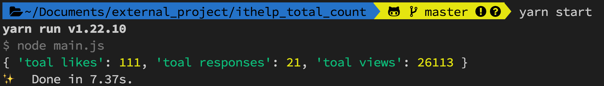

# 計算 IT 邦幫忙自己所有文章的瀏覽/Like/留言總數的工具

我想應該有許多 IT 邦幫忙的作者都很關心自己文章的瀏覽數，像筆者就是一個喜歡三不五時去看看自己文章增加多少瀏覽量的人；剛好有其他創作者提出了一個需求，他希望可以用工具取得自己所有文章的瀏覽/Like/留言總數。

因此筆者就順手研究了一下「puppeteer」這個套件的語法，再花一點時間把小工具寫出來，完整的程式碼如下：

- **main.js**

  ```js
  const puppeteer = require("puppeteer");
  require("dotenv").config();

  (async () => {
    const ithelp_url = process.env.ITHELP_URL || "https://google.com/";
    const browser = await puppeteer.launch({
      headless: process.env.headless == "false" ? false : true,
    });

    let total_likes = 0;
    let total_responses = 0;
    let total_views = 0;
    let p = 0;
    //end = false時while迴圈會中斷
    let end = true;
    const page = await browser.newPage();
    while (end) {
      p == 0 ? await page.goto(ithelp_url) : await page.goto(ithelp_url + `?page=` + p);
      await page.waitForSelector(".profile-main__title");

      let elements = await page.$$(".qa-condition__count");
      if (elements.length > 0) {
        for (var i = 0; i < elements.length; i++) {
          let tmp_text = await page.evaluate((el) => el.textContent, elements[i]);
          if (i % 3 == 0) {
            total_likes += parseInt(tmp_text);
          } else if (i % 3 == 1) {
            total_responses += parseInt(tmp_text);
          } else if (i % 3 == 2) {
            total_views += parseInt(tmp_text);
          }
        }
      } else {
        await browser.close();
        end = false;
      }
      p++;
    }
    console.log({ "toal likes": total_likes, "toal responses": total_responses, "toal views": total_views });
  })();
  ```

- **.env**
  ```sh
  # 填上自己想要爬蟲的頁面，下面是筆者個人的文章頁面喔
  ITHELP_URL=https://ithelp.ithome.com.tw/users/20103256/articles
  # 預設不開啟瀏覽器，如果你想開啟就改成false
  headless=false
  ```

大家也可以到筆者的 [Gihub](https://github.com/dean9703111/ithelp_total_count) 直接把專案 Clone 下來執行

專案的使用方式很簡單，就是去「.env」裡面把「ITHELP_URL」改成自己的網址就好，下面是用筆者在 IT 邦幫忙文章網址的 Demo：

- 使用鐵人賽文章網址：https://ithelp.ithome.com.tw/users/20103256/ironman/4227
  
- 使用個人文章網址：https://ithelp.ithome.com.tw/users/20103256/articles
  
